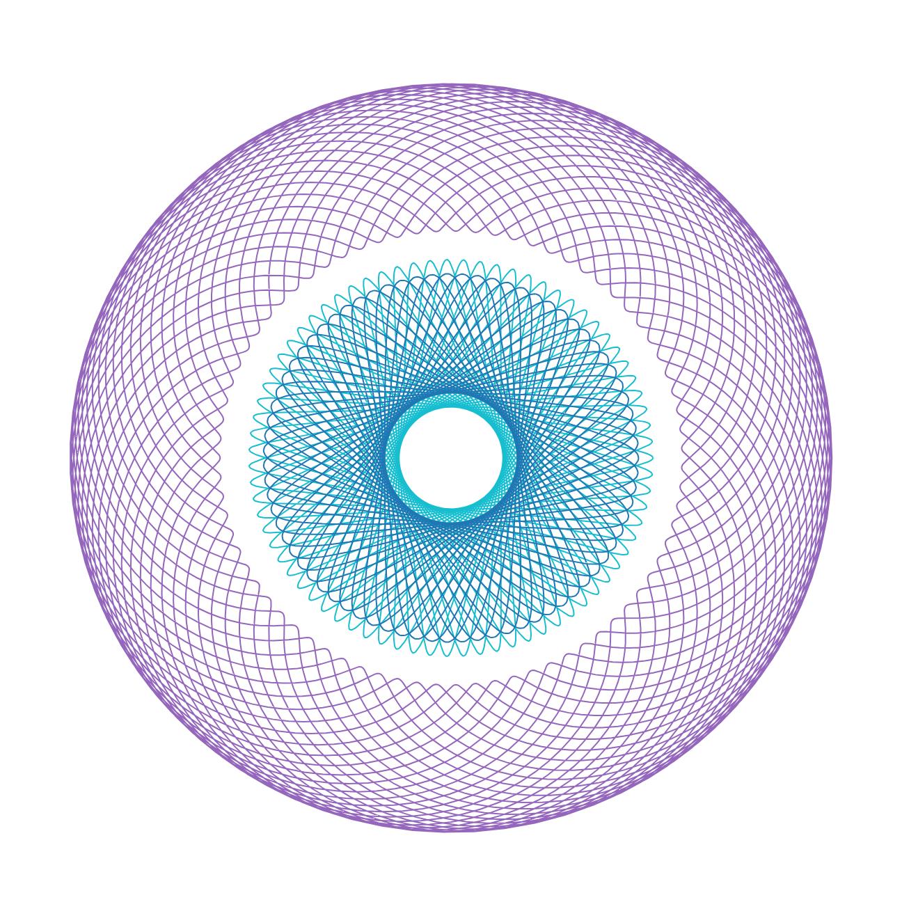

# Spirograph Drawing App

## Table of contents
* [General info](#general-info)
* [Details](#details)
* [Technologies](#technologies)
* [Quick Maths](#quick-maths)
* [Installation and Run](#installation-and-run)
* [Deployment](#deployment)
* [Project Structure](#project-structure)

## General info
This Python web application generates and animates Spirograph drawings based on user input. It utilizes Streamlit with Bootstrap for the interface and NumPy for mathematical calculations. You can access the deployed application via the following link:
https://spirograph-si43nktrqa-lm.a.run.app/

Below, you can see examples of spirographs generated with this app. (The last one uses an elipse as its orbit shape) 





## Details

- **Customizable Orbits**: Choose between circular or elliptical orbits for creating Spirograph drawings. (It can be easily extended to include other types of orbits)
- **Dynamic Parameters**: Adjust parameters such as orbit shape, circle radius, speed of animation, and number of circles to explore different drawing styles.
- **Visualization Options**: Toggle options to show orbit borders and animate the drawing process for interactive visualization.
- **HTML Export**: Generate HTML files containing Spirograph drawings for sharing or embedding in web pages.
- **Containerized App**: Use the provided Dockerfile to containerize this app.
- **Deployed on GCP**: The App was deployed on.

If you toggle animation, you'll see the selected number of revolving cirlces, which are rolling on the selected orbit and drawing lines.

Below, you can see an example input view:


Here, you can see a few frames from the animation process:


## Technologies
* Python 3.10
* Streamlit 1.32.0
* Docker 25
* Bootstrap 5.0
* Javascript + HTML

## Quick Maths
Spirographs are geometric drawings created by rolling a smaller circle inside or outside a larger fixed circle. The rolling circle contains a pen at a fixed distance from its center. As the circle rolls, the pen leaves a mark on the drawing surface and after a certain number of rotations, returns to its starting position.

In order to generate the spirograph, we need to derivce the parametric equation of the pen on the rolling circle. It will determine the resulting spirograph.

Consider a small circle rolling outside the orbit, let's denote the following:

* $\omega_1$ as the angular speed of a point around fixed orbit, and $R$ as the radius of the orbit.
* $\omega_2$ as the angular speed of a point around the orbiting circle, and $r$ as the radius of the smaller circle.

Suppose the center of the smaller circle travels with a speed $v$ around the center of the larger circle.

Because the smaller circle rolls without skidding, the tanget point at any moment, must have $v=0$, so it's need to rotate around the smaller circle with $-v$ velocity (since the whole object is moving with thw speed $v$). 

Let's assume that the smaller circle rolls around the orbit in time $t$. In this time its center will travel the distance: $v \cdot (R+r)$. As the smaller circle rotates with speed v, any point on its perimeter will travel also the distance $v \cdot (R+r)$.

Hence, the number of rotations of the smaller circle will be given by: $N = \frac{(R+r)}{r}$

Let's define:

* $x_{center}, y_{center}$ as the position of the center of the smaller circle
* $x, y$ as the position of the pen
* $shift$ as the distance of the pen to the circle border (NOT to the center!)
* $\omega_2 = \omega_1 \cdot N = \omega_1 \cdot \frac{(R+r)}{r}$
Now the equations are as follows:

$$x_{center}(t) = (R + r) * cos(\omega_1 * t) \newline
y_{center}(t) = (R + r) * sin(\omega_1 * t) \newline
x(t) = (r - shift) * cos(\omega_2 * t) + x_{center}(t) \newline
y(t) = (r - shift) * sin(\omega_2 * t) + y_{center}(t)$$

If the circle rolls inside the orbit, then $N = \frac{(R-r)}{r}$ and we need to substract (instead of adding) r in the above formulas.

For $t$ in the range $\langle 0, 2 \Pi \rangle$ we will achieve a full rotation.

To determine the number of full rotations needed to return to the starting position, we can iterate over $k \geq 1, k \in \Z$.

## Installation and Run

To set up and run this project, you can use the provided Makefile. Execute the following command from the main project folder. It will handle all the necessary installations and run the web app.

```
make run
```

To build docker image run the following command from the main project folder:

```
docker build -t spirograph-app -f Docker/Dockerfile .
```

To run the container with the above image:

```
docker run -p 8501:8501 spirograph-app
```

## Deploymenet

The application has been deployed on Google Cloud Platform (GCP) utilizing Artifact Registry and Cloud Run. To check it out, visit the following link:

https://spirograph-si43nktrqa-lm.a.run.app/

## Project Structure

```
.
├── app.py                  - Main application file to run streamlit
├── Docker                  - Docker configuration folder
│   └── Dockerfile          - Dockerfile for containerization
├── docs                    - Documentation folder
├── .gitignore              - Git ignore file
├── LICENSE                 - License file
├── Makefile                - Makefile to install and run app
├── README.md               - Description and qucik dive into project theory
├── requirements.txt        - Requirements file for project dependencies
└── src                     - Source code folder
    ├── const_params.py     - Constant parameters for application
    ├── controllers.py      - Controllers handling drawing
    ├── html_views          - HTML view templates
    │   └── plots.html      - HTML file to plot and animate given data
    ├── motions.py          - Module for defining motion calculations
    ├── object_views.py     - Views for rendering circle
    ├── orbit_views.py      - Views for managing orbit configurations (here add view managing custom shape)
    └── shapes.py           - Definition of shape objects (circle, elipse etc.)
```

